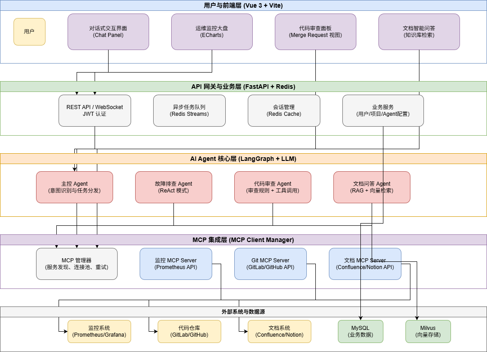
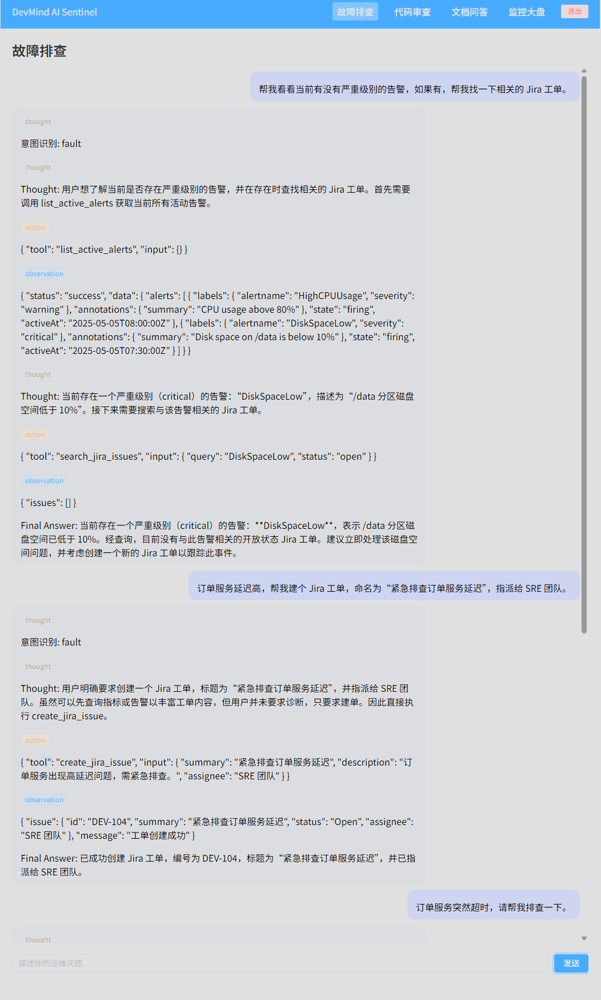
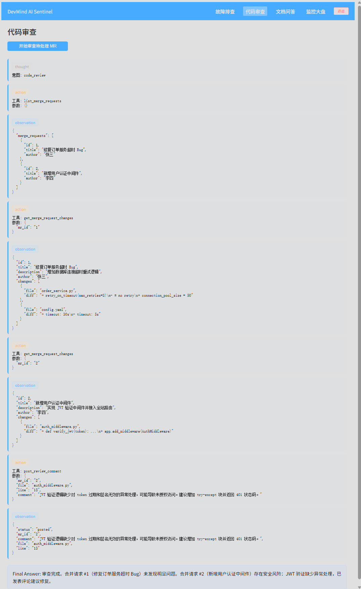
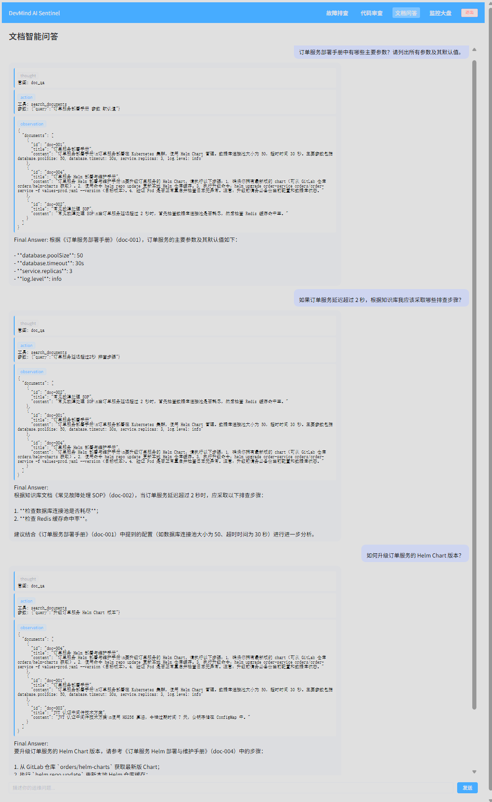
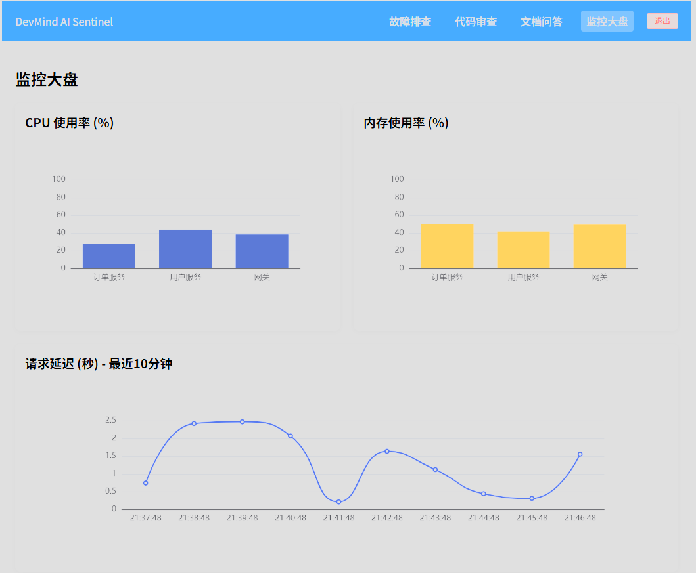
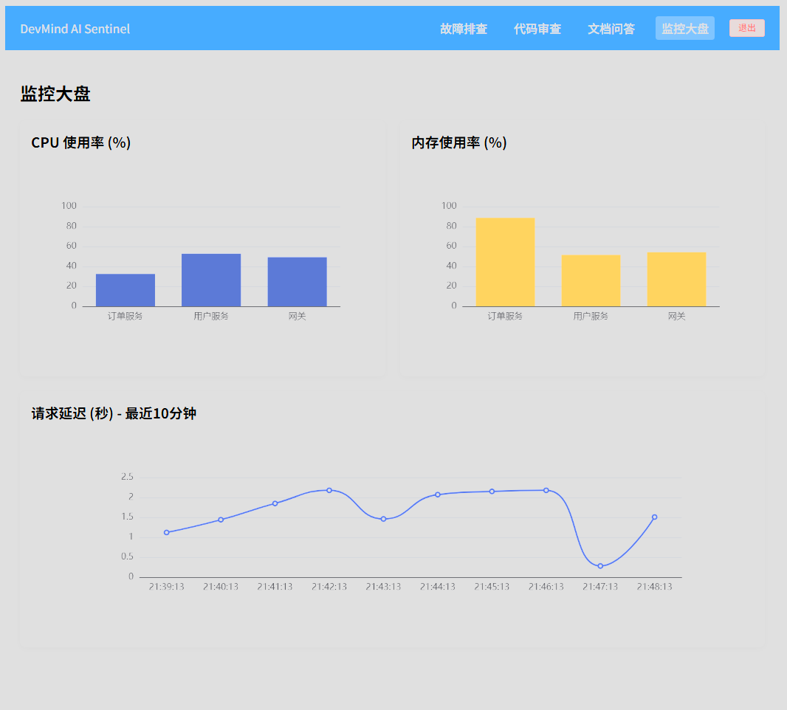

# DevMind AI Sentinel – 基于多智能体协作的智能运维平台

> **一句话概述**：面向云原生微服务环境的智能 Agent 运维助手，以自然语言交互、多 Agent 协作和 MCP 标准协议，将故障定位时间从 20 分钟缩短至 3 分钟。


## 🧠 核心能力

- **故障排查 Agent**：自动查询 Prometheus 指标、告警，并与 Jira 工单联动，输出诊断结论和处理建议  
- **代码审查 Agent**：检测 MR 变更内容，识别安全漏洞、逻辑缺陷，自动发表行级评论  
- **文档问答 Agent**：基于 RAG 技术搜索 Confluence 知识库，回答部署、故障 SOP、技术方案等问题  
- **监控大盘**：实时展示 CPU、内存、请求延迟等核心指标，自动刷新  

---

## 🏗️ 系统设计图（Architecture）



---

## 🏗️ 技术架构（文本版）

```
┌─────────────┐     ┌─────────────┐     ┌───────────────────────┐
│   Vue3      │     │  FastAPI    │     │     Agent 核心层       │
│   前端      │◄───►│   后端      │◄───►│ ├ Supervisor          │
│ (SSE 流式)  │     │ (JWT 鉴权)  │     │ ├ FaultDiagnosis      │
└─────────────┘     └─────────────┘     │ ├ CodeReview          │
                                        │ └ DocQA (RAG)         │
                                        └────────┬──────────────┘
                                                 │ MCP 协议
                                  ┌──────────────▼──────────────┐
                                  │        MCP 管理器            │
                                  │ ├ Prometheus Server          │
                                  │ ├ Jira Server                │
                                  │ ├ GitLab Server              │
                                  │ └ Confluence Server          │
                                  └──────────────────────────────┘
```

## ⚙️ 技术栈

- **前端**：Vue3 + TypeScript + Pinia + Element Plus + ECharts
- **后端**：FastAPI + SQLAlchemy + SQLite/MySQL + Redis
- **AI 引擎**：LangChain + LangGraph + 通义千问 (Qwen) + DashScope Embeddings
- **工具协议**：MCP (Model Context Protocol)，所有外部系统统一封装为 MCP Server
- **向量检索**：Chroma 向量数据库 + 自研 DashScopeEmbeddings 适配

## 📂 项目结构

```
DevMind AI Sentinel/
├── backend/                 # FastAPI 后端
│   ├── app/
│   │   ├── agent/           # Supervisor / Fault / CodeReview / DocQA 智能体
│   │   ├── mcp/             # MCP 管理器及工具服务器
│   │   ├── api/             # 路由接口
│   │   ├── core/            # 配置、安全、LLM 工厂、Embedding 工厂
│   │   ├── models/          # 数据库模型
│   │   ├── schemas/         # Pydantic 请求/响应模型
│   │   └── rag/             # 向量存储与检索 (Chroma)
│   ├── main.py
│   ├── Dockerfile
│   └── requirements.txt
├── frontend/                # Vue3 前端
│   ├── src/
│   │   ├── api/             # axios 封装、SSE 流式连接
│   │   ├── components/      # 通用组件
│   │   ├── views/           # 页面
│   │   ├── router/          # 路由守卫
│   │   └── store/           # Pinia 状态管理
│   ├── Dockerfile
│   └── package.json
├── docker-compose.yml       # 一键启动
└── README.md
```

## 🚀 快速开始

### 1. 环境准备

- Python 3.11+
- Node.js 18+
- Docker & Docker Compose (可选)
- 通义千问 API Key (https://dashscope.aliyun.com)

### 2. 本地开发

**后端**
```bash
cd backend
python -m venv venv
source venv/bin/activate   # Windows: .\venv\Scripts\activate
pip install -r requirements.txt
cp .env.example .env        # 填写 OPENAI_API_KEY 和 DASHSCOPE_API_KEY
uvicorn main:app --reload
```

**前端**
```bash
cd frontend
npm install
npm run dev
```
浏览器访问 http://localhost:5173

### 3. Docker 一键部署

```bash
docker-compose up -d --build
```
访问 http://localhost:5173

## 🧪 效果展示

| 功能                           | 截图      |
|--------------------------------|-----------|
| 故障排查 Agent 多工具联动      |  |
| 代码审查 Agent 自动评论        |  |
| 文档问答 Agent 语义检索        |  |
| 监控大盘实时刷新               |   |

## 🎯 简历亮点

- 前沿技术栈：LangGraph 多 Agent 编排、MCP 协议统一工具接口、RAG 向量检索、SSE 流式输出。
- 工业级工程能力：前后端分离、JWT 认证、Docker 部署、异步任务、打字机流式体验。
- 真实业务场景：覆盖 SRE 故障排查、DevOps 代码审查、文档助手、监控大盘，完整运维闭环。
- 模型适配：自定义 DashScopeEmbeddings 适配国产大模型，体现实际落地的工程化思维。

## 📄 License

MIT

## 👤 作者

[王磊]: https://github.com/leonleiwang – 求职 AI Agent / 大模型应用开发工程师，欢迎联系 [leonleiwang@outlook.com]
